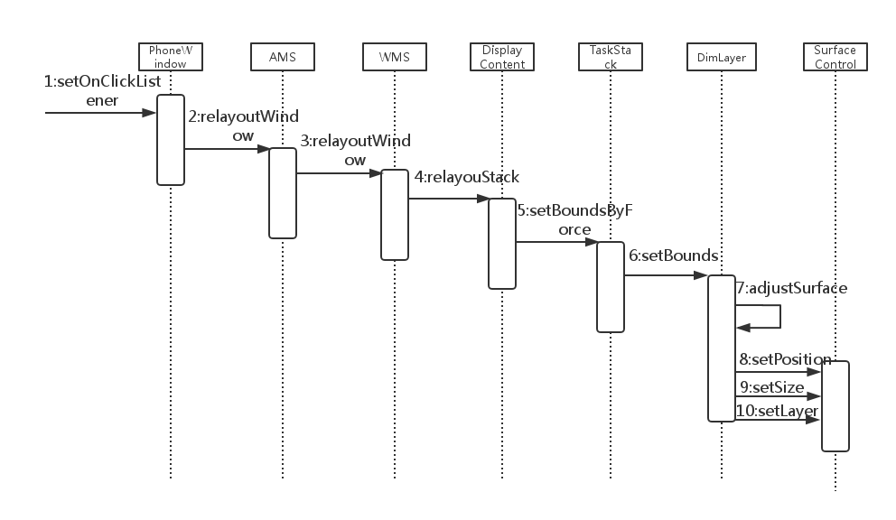

# MultiWindow中Activity窗口的最大化最小化功能的初步分析

### 方法调用流程



### 1.PhoneWindow.java分析

- 最大化涉及代码：

```
mMaximizeBtn.setOnClickListener(new OnClickListener() {
    @Override
    public void onClick(View v) {
        // 当前实际窗口的大小
        Rect actualWindowSize = new Rect(mDecor.getViewRootImpl().mWinFrame);
        try {
            // 最大化窗口的大小
            Rect customMaximizedWindowSize = ActivityManagerNative.getDefault().getMaximizedWindowSize();
            if (!customMaximizedWindowSize.equals(new Rect())) {
                mFullScreen = customMaximizedWindowSize;
            } else {
                mFullScreen = new Rect(0, 0, metrics.widthPixels, metrics.heightPixels);
            }    

            if (!actualWindowSize.equals(mFullScreen)){ // 若当前窗口的大小不是最大化窗口的大小，即窗口还不是全屏
                // 保存当前窗口的大小，方便以后进行恢复操作
                mOldSize = actualWindowSize;
                // 将窗口设置为全屏
                ActivityManagerNative.getDefault().relayoutWindow(getStackId(), mFullScreen);
                // 更新现在实际窗口的大小
                actualWindowSize = mFullScreen;
            } else { // 若当前窗口的大小就是最大化窗口的大小，即窗口已是全屏
                if (mOldSize == null) {
                    mOldSize = new Rect(mDecor.getViewRootImpl().mWinFrame);
                }
                // 更新实际窗口大小    
                actualWindowSize = mOldSize;
                // 将窗口大小更新为为全屏之前窗口的大小
                ActivityManagerNative.getDefault().relayoutWindow(getStackId(), mOldSize);
            }    
        } catch (RemoteException e) {
            Log.e(TAG, "Maximize failed", e);
        }    
    }    
});
```

- 最小化涉及代码：

```
mMinimizeBtn.setOnClickListener(new OnClickListener() {
    @Override
    public void onClick(View v) {
        // 当前实际窗口的大小
        Rect actualWindowSize = new Rect(mDecor.getViewRootImpl().mWinFrame);
        // 设置新的窗口尺寸，使窗口移出屏幕
        Rect outOfScreen = new Rect(actualWindowSize.left + metrics.widthPixels,
                                    actualWindowSize.top + metrics.heightPixels,
                                    actualWindowSize.right + metrics.widthPixels,
                                    actualWindowSize.bottom + metrics.heightPixels);
        try {
            // 保存当前窗口的大小，方便以后进行恢复操作
            ActivityManagerNative.getDefault().saveInfoInStatusbarActivity(getStackId(), actualWindowSize);
            // 将窗口设置为最小化
            ActivityManagerNative.getDefault().relayoutWindow(getStackId(), outOfScreen);
        } catch (RemoteException e) {
            Log.e(TAG, "Minimize failed", e);
        }    
        unsetFocusedStack();
    }    
});
```


### 2.ActivityManagerService.java分析

- 涉及代码：

```
@Override
public boolean relayoutWindow(int stackId, Rect r) {
    /**
     * Date: Feb 25, 2014
     * Copyright (C) 2014 Tieto Poland Sp. z o.o.
     *
     * TietoTODO: add posibility to relayout only own window
     */
    long ident = Binder.clearCallingIdentity();
    try {
        Slog.v(TAG, "RelayoutWindow: " + stackId + " pos:" + r);
        // 调用WindowManager对象的方法
        mWindowManager.relayoutWindow(stackId, r);
    } finally {
        Binder.restoreCallingIdentity(ident);
    }     
    return true;
}
```

### 3.WindowManagerService.java分析

- 涉及代码：

```
public boolean relayoutWindow(int stackId, Rect pos) {
    synchronized (mWindowMap) {
        final int numDisplays = mDisplayContents.size();
        for (int displayNdx = 0; displayNdx < numDisplays; ++displayNdx) {
            if (mDisplayContents.valueAt(displayNdx).relayoutStack(stackId, pos)) { // 调用DisplayContent对象的方法
                performLayoutAndPlaceSurfacesLocked();
                return true;
            }     
        }     
    }     
    return false;
}
```

### 4.DisplayContent.java分析

- 一个DisplayContent描述了一块可以绘制窗口的屏幕。每一个DisplayContent至少包含一个TaskStack。

- 涉及代码：

```
boolean relayoutStack(int stackId, Rect pos) {
    for (int stackNdx = mStacks.size() - 1; stackNdx >= 0; --stackNdx) { // 通过一个循环来找到该stackId所对应的Activity
        final TaskStack stack = mStacks.get(stackNdx);
        if (stack.mStackId == stackId) {
            stack.setCrappyRelayouted(true);
            layoutNeeded = true;
            // 调用TaskStack对象的方法
            return stack.setBoundsByForce(pos);
        }   
    }   
    return false;
}
```

### 5.TaskStack.java分析

- 涉及代码：

```
boolean setBoundsByForce(Rect bounds) {
    // 调用DimLayer对象的方法
    mDimLayer.setBounds(bounds);
    mAnimationBackgroundSurface.setBounds(bounds);
    mBounds.set(bounds);
    return true;
}
```

### 6.DimLayer.java分析

- DimLayer对象，用来实现阴影效果的Surface包装类对象。

- android5.1x86涉及代码：

```
void setBounds(Rect bounds) {
    mBounds.set(bounds);
    if (isDimming() && !mLastBounds.equals(bounds)) {
        adjustSurface(mLayer, false);
    }
}
```

```
/**
 * @param layer The new layer value.
 * @param inTransaction Whether the call is made within a surface transaction.
 */
void adjustSurface(int layer, boolean inTransaction) {
    final int dw, dh;
    final float xPos, yPos;
    if (!mStack.isFullscreen() || mStack.isCrappyRelayouted()) {
        dw = mBounds.width();
        dh = mBounds.height();
        xPos = mBounds.left;
        yPos = mBounds.top;
    } else {
        // Set surface size to screen size.
        final DisplayInfo info = mDisplayContent.getDisplayInfo();
        // Multiply by 1.5 so that rotating a frozen surface that includes this does not expose
        // a corner.
        dw = (int) (info.logicalWidth * 1.5);
        dh = (int) (info.logicalHeight * 1.5);
        // back off position so 1/4 of Surface is before and 1/4 is after.
        xPos = -1 * dw / 6;
        yPos = -1 * dh / 6;
    }   

    try {
        if (!inTransaction) {
            SurfaceControl.openTransaction();
        }
        // 调用SurfaceControl对象的方法，设置Activity窗口的位置
        mDimSurface.setPosition(xPos, yPos);
        // 调用SurfaceControl对象的方法，设置Activity窗口的大小
        mDimSurface.setSize(dw, dh);
        mDimSurface.setLayer(layer);
    } catch (RuntimeException e) {
        Slog.w(TAG, "Failure setting size or layer", e);
    } finally {
        if (!inTransaction) {
            SurfaceControl.closeTransaction();
        }
    }
    mLastBounds.set(mBounds);
    mLayer = layer;
}
```

- android6.0x86涉及代码：

```
/** @param bounds The new bounds to set */
void setBounds(Rect bounds) {
    mBounds.set(bounds);
    if (isDimming() && !mLastBounds.equals(bounds)) {
        try {
            SurfaceControl.openTransaction();
            adjustBounds();
        } catch (RuntimeException e) {
            Slog.w(TAG, "Failure setting size", e); 
        } finally {
            SurfaceControl.closeTransaction();
        }   
    }   
}   
```

```
/**
 * NOTE: Must be called with Surface transaction open.
 */
private void adjustBounds() {
    final int dw, dh;
    final float xPos, yPos;
    if (!mStack.isFullscreen()) {
        dw = mBounds.width();
        dh = mBounds.height();
        xPos = mBounds.left;
        yPos = mBounds.top;
    } else {
        // Set surface size to screen size.
        final DisplayInfo info = mDisplayContent.getDisplayInfo();
        // Multiply by 1.5 so that rotating a frozen surface that includes this does not expose
        // a corner.
        dw = (int) (info.logicalWidth * 1.5);
        dh = (int) (info.logicalHeight * 1.5);
        // back off position so 1/4 of Surface is before and 1/4 is after.
        xPos = -1 * dw / 6;
        yPos = -1 * dh / 6;
    }   

    mDimSurface.setPosition(xPos, yPos);
    mDimSurface.setSize(dw, dh);

    mLastBounds.set(mBounds);
}   
```

### 7.SurfaceControl.java分析

- 涉及代码：

```
public void setLayer(int zorder) {
    checkNotReleased();
    // 通过JNI调用本地方法
    nativeSetLayer(mNativeObject, zorder);
}   

public void setPosition(float x, float y) {
    checkNotReleased();
    // 通过JNI调用本地方法，设置位置
    nativeSetPosition(mNativeObject, x, y);
}   

public void setSize(int w, int h) {
    checkNotReleased();
    // 通过JNI调用本地方法，设置大小
    nativeSetSize(mNativeObject, w, h);
}   
```
