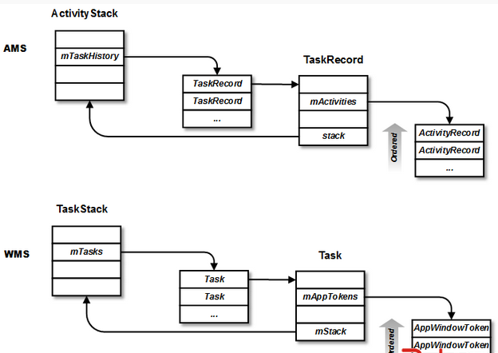
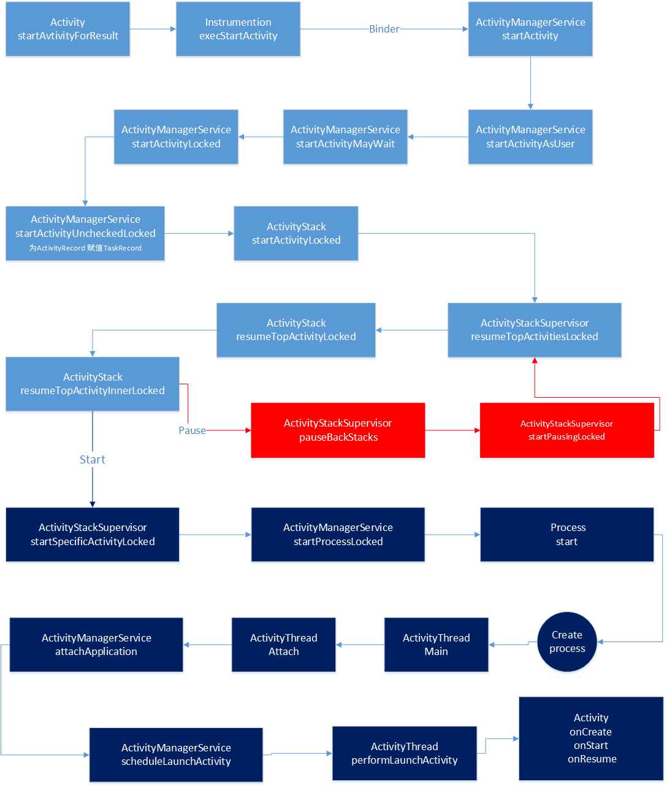

### ActivityManagerService WindowManagerService 数据结构

- ActivityTask 可以理解为一个任务，一个任务可能由多Activity协同完成，存储Task所需的Activity（AcivityRecord）。
- ActivityRecord 就是存储Activity信息的对象,与Acivity一一对应。
- ActivityStack Task栈，一般情况下只有两个，一个Launcher使用Home，AcivivtyStack，还有个是普通的AcivityStack
> 上面三者的关系可以理解为 ActivityStack代表公司，ActivityTask代表部门，
> ActivityRecord代表员工。一个部门完成一个任务，同时员工能在多个部门任职，都由公司进行总得管理。
> Acivity 在AMS中对应物为 ActivityRecord

- AppWindowToken AppWindowToken里的token实际上就是指向了一个Activity。
- TaskStack、Task 用于管理AppWindowToken。和AMS类似，每个AppWindowToken作为一个列表被管理在TaskStack中的mTasks成员中，并且是按历史顺序存放的，最老的Task在最底下。wms通过对TaskStack的stackId对窗口进行操作。

- WindowState 和客户端窗口一一对应，WMS中最基本的元素，描述WMS中的一个窗口。
> Activity 在WMS的对应物为AppWindowToken。

- ProcessRecord 标识了Activity所在的进程，ProcessRecord和ActivityRecord是一对多的关系。记录了进程id、进程名字和各种用于调节优先级的状态。还包含了所有运行在该进程的Activity、Service、Receiver、Provider等组件。

      ActivityStackSupervisor
      ActivityStackSupervisor 类是用来辅助管理ActivityStack的，
      里面有mHomeStack，mFocusedStack 和 mLastFocusedStack
      ，[桌面home的stack，聚焦的stack，上一次聚焦stack]
      它们的类型都是ActivityStack ，
      ActivityStackSupervisor 中主要是对它们的调度算法的一些操作

### Activity的启动过程

- 1 ActivityManagerService.startActivity
- 2 ActivityManagerService.startActivityAsUser
- 3 ActivityManagerService.startActivityMayWait
- 4 ActivityManagerService.startActivityLocked
> 这个函数主要是把传入的参数封装成activityRecord

- 5  ActivityManagerService.startActivityUncheckedLocked
> 为ActivityRecord 赋值TaskRecord
> 如果已经有相关task，则不需要创建新的task，可以使用已有的task
> 如果要启动的activity的启动模式是LAUNCH_SINGLE_INSTANCE,
> 则使用快速查找方法findTaskLocked，否则使用慢速查找方法findActivityLocked
> 若record 还没有task，为 record 新建 task

- 6 ActivityStack.startActivityLocked
- 7 ActivityStackSupervisor.resumeTopActivitiesLocked
- 8 ActivityStack.resumeTopActivityLocked
- 9 ActivityStack.resumeTopActivityInnerLocked

- 10 ActivityStackSupervisor.pauseBackStacks 暂停当前运行的Activity
- 11 ActivityStackSupervisor.startPausingLocked
  - ActivityRecord.app.thread.schedulePauseActivity

        -> ActivityThread.handlePauseActivity
          -> performPauseActivity
            -> Instrumentation.callActivityOnPause
              -> Activity.performPause
  - ActivityManagerNative.getDefault().activityPaused(token)

        ->  ActivityStack.activityPausedLocked
          -> ActivityStack.completePauseLocked
            -> ActivityStackSupervisor.resumeTopActivitiesLocked
              -> ActivityStack..resumeTopActivityLocked
                -> resumeTopActivityInnerLocked
                  -> ActivityStackSupervisor.startSpecificActivityLocked

- 12 完成暂停后悔再次调用ActivityStackSupervisor.resumeTopActivitiesLocked
- 13 再次调用这个函数已经暂停Activity，会调用ActivityStackSupervisor.startSpecificActivityLocked
- 14 ActivityManagerService.startProcessLocked 新建进程
- 15 Process.start
- 16 ApplicationThread.scheduleLaunchActivity
- 17 ActivityThread.performLaunchActivity 创建Activity，对onCreate进行间接调用，到这整个Activity就启动了。
- 18 Activity.onCreate  onStart onResume

### window 创建

- AMS.startActivity
- Activity.attach
- PolicyManager.MakeNewWindow
- ViewRootImpl.setView
- WMS.addWindow
- ViewRootImpl.performTraversals
- ViewRootImpl.relayoutWindow
- WMS.relayoutWindow
- WindowState.createSurfaceLocked
