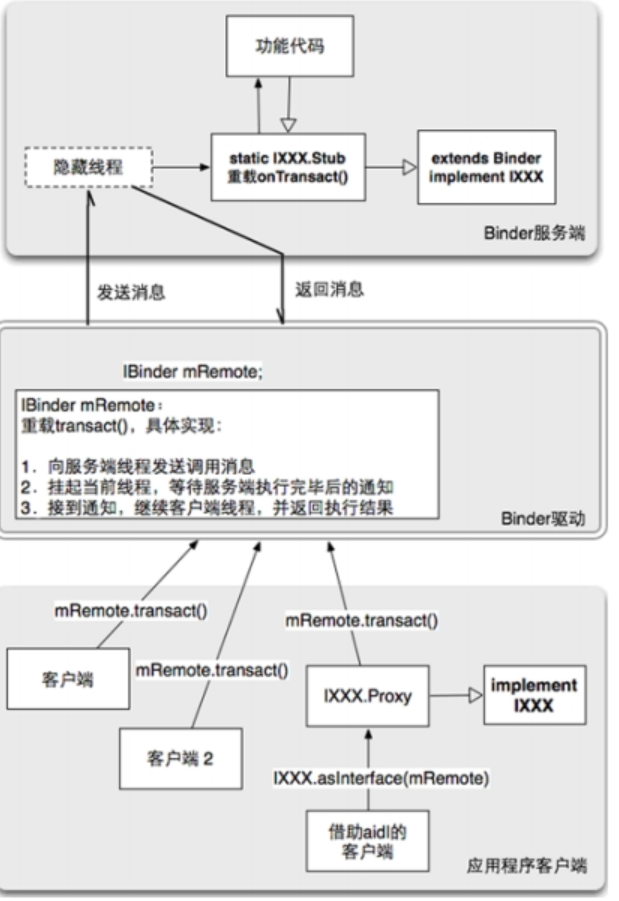

# 系统级Binder  mechanism

1. Binder的使用一般是用于系统服务的扩展，最重要的两个方法trasact()、onTrasact()

2. Service基于Binder之上，主要是提供为应用开发者使用

所以我们目前关注系统Binder的使用

## Binder是一种架构，这种架构提供了服务端接口、Binder驱动、客户端接口三个模块
- 服务端：一个Binder服务端实际上就是一个Binder类的对象，该对象一旦创建，内部就启动一个隐藏线程。该线程接下来会接收Binder驱动发送的消息，收到消息后，会执行到Binder对象中的onTransact()函数，并按照该函数的参数执行不同的服务代码。因此，要实现一个Binder服务，就必须重载onTransact()方法。重载onTransact()函数的主要内容是把onTransact()函数的参数转换为服务函数的参数，而onTransact()函数的参数来源是客户端调用transact()函数时输入的，因此，如果transact()有固定格式的输入，那么onTransact()就会有固定格式的输出。

- Binder驱动：任意一个服务端Binder对象被创建时，同时会在Binder驱动中创建一个mRemote对象，该对象的类型也是Binder类。客户端要访问远程服务时，都是通过mRemote对象。

- 客户端：客户端要想访问远程服务，必须获取远程服务在Binder对象中对应的mRemote引用

## trasact()与onTrasact()方法
trasact方法共有四个参数，分别是标识code、传输输入data、返回数据reply、flag

- code用于在onTrasact方法中标识传输过来的data属于什么数据，例如是名字还是密码，一般是用switch语句进行判断

- data与replay的数据结构类型的parcel，这个是一个共享的存储区域，能存储基本的数据结构包括Int、String等也可以parcel递归存储parcel

Flag有两种参数：

1. 一种是双向的，用常量0表示，其含义是服务端执行完指定服务后返回一定的数据

2. 一种是单项的，用常量1表示，其含义是不返回任何数据